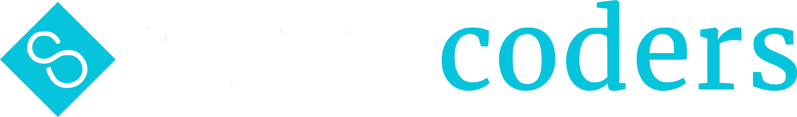

We endeavor to give back to our communities by increasing tech talent and expanding business opportunities. We designed a comprehensive curriculum that would allow our students to expand their professional horizons in 12-20 weeks.

## [Full Stack Development](https://savvycoders.com/fullstackwebdevelopment/)

During this 12-week, virtual evening course, students will be taken from knowing just a few basics of web development to being fully qualified for junior developer positions. 

## [Data Analytics + Python](https://savvycoders.com/dataanalyticspython/)

This intensive 12-week, virtual evening course focused primarily on learning everything there is to know about analyzing big datasets efficiently. Students will begin by knowing just the basics of coding and/or data analysis techniques to become fully qualified for a Data Analyst position.

## [Cybersecurity + Ops](https://savvycoders.com/cybersecurity/)

Ready to enter the world of Cybersecurity? Learn all about it in just 20 weeks during our virutal, evening cours and be one step closer to a career in this exciting field. With trained and knowledgeable instructors, students will take classes at an accelerated pace so they can start their new careers after only 20 weeks!

Find out more information [visit Savvy Coders](https://www.savvycoders.com)